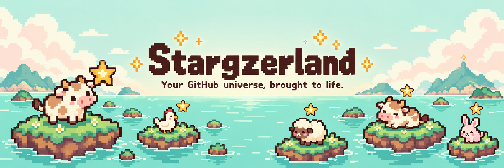
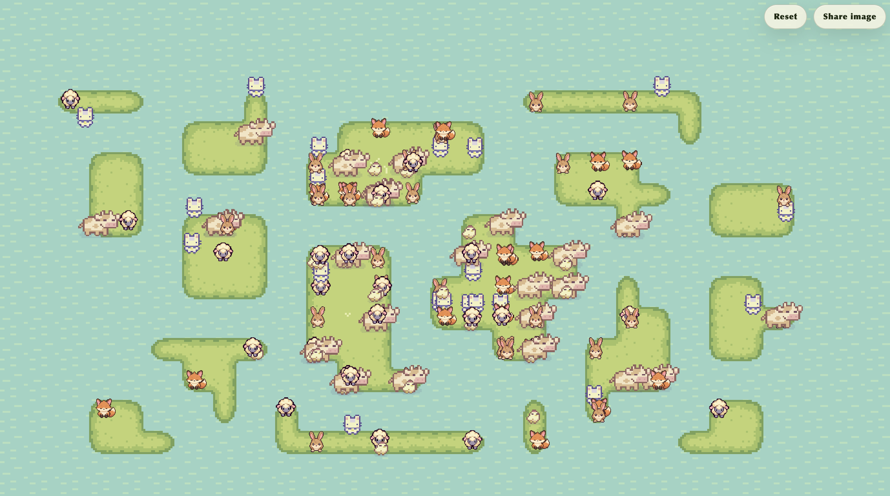

# Stargazerland

Your GitHub islands with cute animals!

## What Is This?

Islands represent your GitHub repositories that have at least one star, and animals represent their stargazers. The more stars a repository has, the bigger its island and the larger its animal population.

## Showcase

